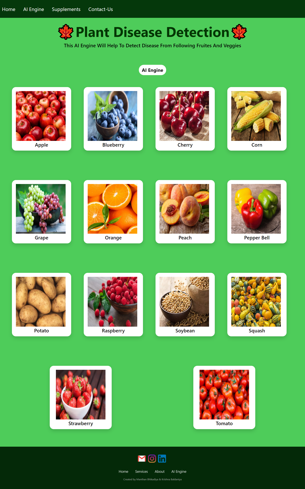
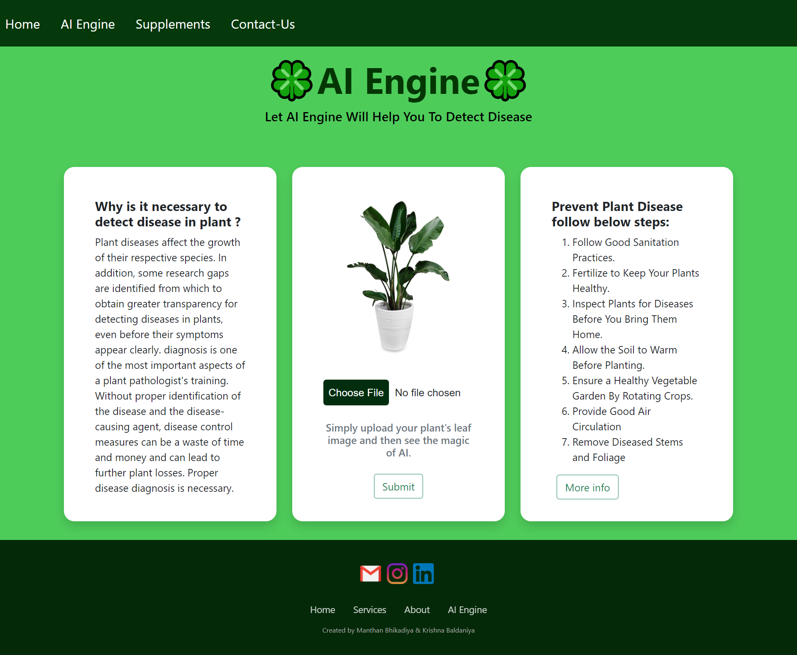
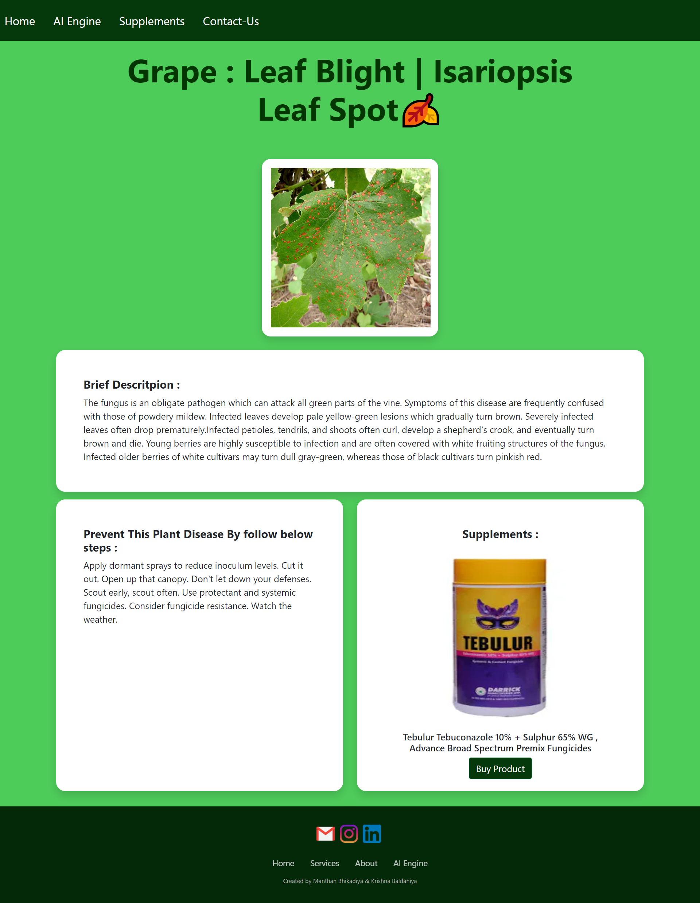
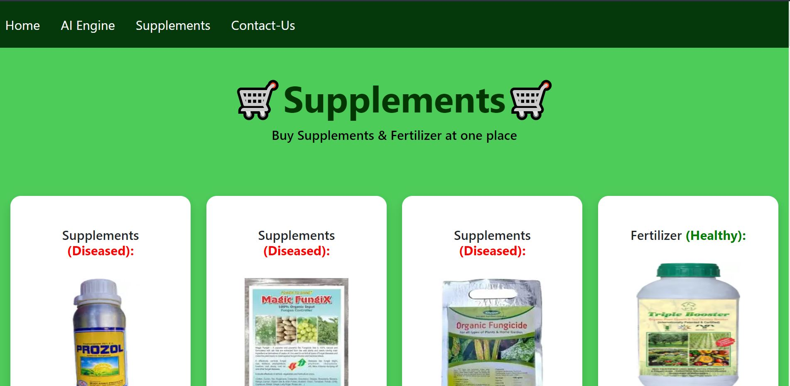
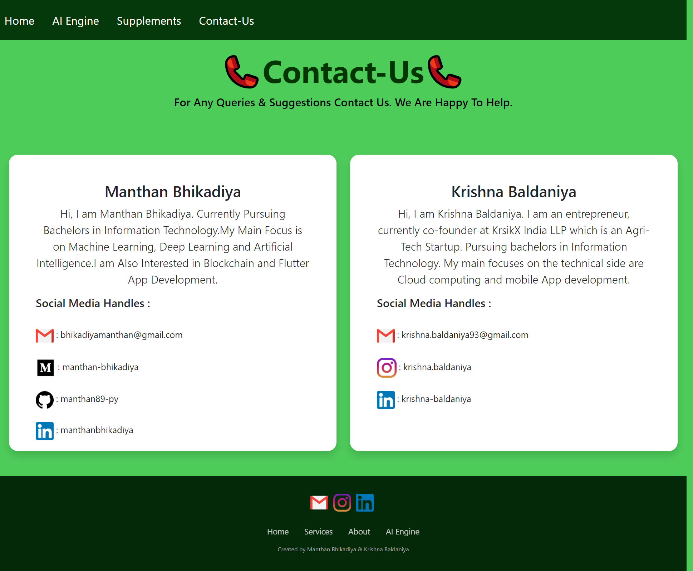

# ⭐Plant-Disease-Detection
* Plant Disease is necessary for every farmer so we are created Plant disease detection using Deep learning. In which we are using convolutional Neural Network for classifying Leaf images into 39 Different Categories. The Convolutional Neural Code build in Pytorch Framework. For Training we are using Plant village dataset. Dataset Link is in My Blog Section.

## ⭐Run Project in your Machine
* You must have **Python3.8** installed in your machine.
* Create a Python Virtual Environment & Activate Virtual Environment [Link](https://docs.python.org/3/tutorial/venv.html)
* Install all the dependencies using below command
    `pip install -r requirements.txt`
* Go to the `Flask Deployed App` folder.
* Download the pre-trained model file `plant_disease_model_1.pt` from [here](https://drive.google.com/drive/folders/1ewJWAiduGuld_9oGSrTuLumg9y62qS6A?usp=share_link)
* Add the downloaded file in `Flask Deployed App` folder.
* Run the Flask app using below command `python3 app.py`
* You can also use downloaded file in `Model` Section and play with it using Jupyter Notebook.

## ⭐Contribution ( Open Source )
* This Project is now open source.
* All the developers who are intrested they can contribute in this project.
* Yo can make UI better , make Deep learning model more powerful , add informative markdown file in section...
* If you will change Deep learning make sure you upload updated markdown file (.md) , .pdf and .ipynb in particular section.
* Make sure your code is working. It will not have any type or error.
* You have to fork this project then make a pull request after you testing will successful.
* How to make pull request : https://opensource.com/article/19/7/create-pull-request-github

## ⭐Testing Images

* If you do not have leaf images then you can use test images located in test_images folder
* Each image has its corresponding disease name, so you can verify whether the model is working perfectly or not

## ⭐Blog Link
<a href="https://medium.com/analytics-vidhya/plant-disease-detection-using-convolutional-neural-networks-and-pytorch-87c00c54c88f" target = "_blank">Plant Disease Detection Using Convolutional Neural Networks with PyTorch</a> 

## ⭐Deployed App
<a href="https://plant-disease-detection-ai.herokuapp.com/" target = "_blank">Plant-Disease-Detection-AI</a> 

## ⭐Snippet of Web App :
#### Main page
  
#### AI Engine 
  
#### Results Page 
  
#### Supplements/Fertilizer  Store
  
#### Contact Us 
   

---

# 🧪 Changes Made for SCAD Semester Project

This project was modified as part of the **Software Construction and Development (SCAD)** course lab terminal assignment.

## Original Project
- **Author:** [manthan89-py](https://github.com/manthan89-py)
- **Original Repo:** [Plant-Disease-Detection](https://github.com/manthan89-py/Plant-Disease-Detection)
- **License:** Open source (see original repo for details)

## Changes & Enhancements Applied

### 1. 📋 Trello Board
Created a project management board to track tasks: [Plant Disease Detection Trello Board](https://trello.com/b/l1HwlVAl/plant-disease-detection)

### 2. 📐 UML Diagrams
- **Use Case Diagram** — Illustrates user interactions (upload image, view prediction, browse marketplace, contact support)
- **Flow Chart (Activity Diagram)** — End-to-end flow from image upload to result display

### 3. 🧪 Unit Testing (	esting.py)
Added 6 test classes using Python's unittest framework:
- TestCSVDataLoading — Validates CSV file integrity (39 rows, required columns, no null data)
- TestClassMapping — Ensures CNN class indices are contiguous (0..38) and names are unique
- TestImagePreprocessing — Verifies image resize to 224×224 from various input sizes
- TestModelStructure — Checks CNN architecture (conv layers, output shape, logits vs probabilities)
- TestTorchTensorConversion — Validates PIL-to-tensor conversion (shape, value range)

### 4. 📬 Postman API Testing
Added a **Postman collection** (Plant-Disease-Detection.postman_collection.json) with 6 pre-configured requests:
- Home page GET
- AI Engine page GET
- Image upload + prediction POST
- Marketplace page GET
- Contact page GET
- Error case (empty POST)

### 5. 🧵 Threading
Applied threading concepts to the Flask app (pp.py):
- **Background model loading** — Model loads in a daemon thread so the Flask app boots faster
- **Thread-safe inference** — A 	hreading.Lock guards model inference (PyTorch models are not fully thread-safe)
- **ThreadPoolExecutor** — Prediction runs in a thread pool to keep the request handler responsive

### 6. 🌐 Web Interface
The existing Flask-based web interface was preserved and enhanced with:
- Proper error handling for edge cases
- Thread-safe model serving
- Responsive HTML templates

### 7. 🚀 Deployment
Deployed on **Hugging Face Spaces** (link below).

---

## 🔗 Links
- **Original Repository:** https://github.com/manthan89-py/Plant-Disease-Detection
- **Deployed App (Hugging Face):** https://huggingface.co/spaces/[your-username]/plant-disease-detection
- **Trello Board:** https://trello.com/b/l1HwlVAl/plant-disease-detection

## 👏 Acknowledgements
Special thanks to **manthan89-py** for creating and open-sourcing the original Plant Disease Detection project. This work builds upon their foundation by adding software engineering best practices (testing, threading, API testing, project management) as part of the SCAD course curriculum.
